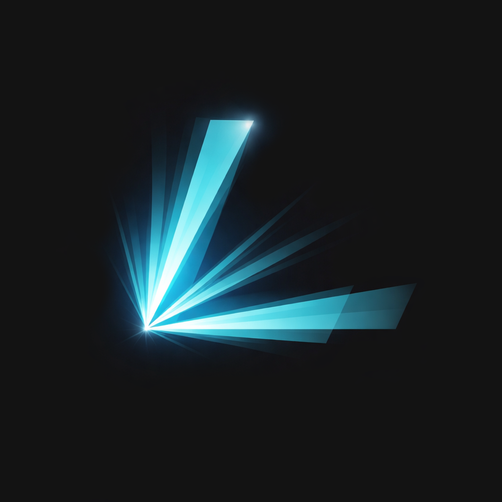

  

<h1 align="center">Luma</h1>

  

Procedural lighting control for portable light shows that work across any venue. Traditional lighting consoles record hardware-specific DMX instructions that break when you change venues. Luma records *intent* — patterns that automatically adapt to whatever fixtures are in the room.

Think of it like sheet music vs. a recording. Sheet music says "play a C major chord" and works on any instrument. Luma says "red circular pulse" and works on any rig.

## Documentation

- **[User Guide](https://luma.show/docs/user-guide/why-luma)** — How Luma works, the full workflow from venue setup to live performance
- **[Architecture](https://luma.show/docs/architecture/overview)** — Signal system, compositor, DMX pipeline, design decisions
- **[Node Reference](https://luma.show/docs/node-reference)** — Complete reference for all pattern graph node types

## The Workflow

1. **Define your venue** — Patch fixtures, set 3D positions and rotations
2. **Tag groups** — Organize fixtures into groups with spatial tags (`front`, `circular`, `has_movement`)
3. **Import tracks** — From Engine DJ or audio files; auto-analyzes beats, stems, chords
4. **Define patterns** — Visual node graphs that generate lighting from audio/beat data
5. **Annotate tracks** — Place patterns on a timeline with layering and blend modes
6. **Perform** — Plug in your Denon DJ deck, Luma syncs via StageLinQ and outputs ArtNet DMX

## Project Structure

- **`src/`** — React/TypeScript frontend (Zustand, React Flow graph editor, Three.js 3D visualizer)
- **`src-tauri/`** — Rust backend (Tauri 2, SQLite, petgraph node engine, audio DSP, ArtNet)
- **`www/`** — Documentation site ([luma.show](https://luma.show))
- **`resources/fixtures/`** — QLC+ fixture definition library (thousands of fixtures)
- **`experiments/`** — Research code and test data

## Getting Started

1. Install [Bun](https://bun.sh): `curl -fsSL https://bun.sh/install | bash`

2. Install [Rust](https://rust-lang.org/tools/install/)

3. Clone with submodules: `git submodule update --init --recursive`

4. Install JS dependencies: `bun install`

5. Start development: `bun run tauri dev`

Python 3.12 is required for ML analysis workers (beat detection, stem separation, chord analysis). The app will prompt you to set up the Python environment on first track import.
