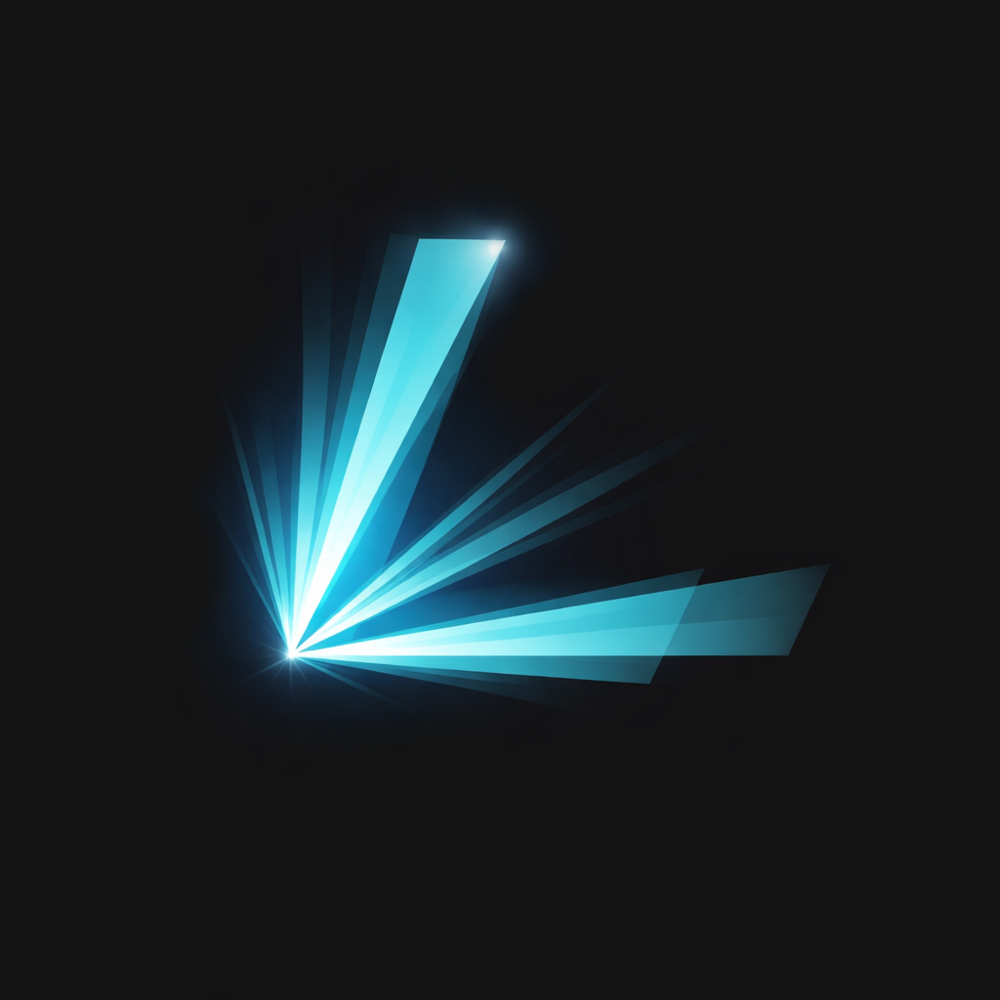

  

<h1 align="center">Luma</h1>

  

Procedural lighting control for portable light shows that work across any venue. Traditional lighting consoles record hardware-specific DMX instructions that break when you change venues. Luma records *intent* — patterns that automatically adapt to whatever fixtures are in the room.

Think of it like sheet music vs. a recording. Sheet music says "play a C major chord" and works on any instrument. Luma says "red circular pulse" and works on any rig.

## Documentation

- **[User Guide](https://luma.show/docs/user-guide/why-luma)** — How Luma works, the full workflow from venue setup to live performance
- **[Architecture](https://luma.show/docs/architecture/overview)** — Node graph engine, compositor, DMX pipeline, fixture system, database, design decisions
- **[Node Reference](https://luma.show/docs/node-reference)** — Pattern graph nodes, one page per category

## The Workflow

1. **Define your venue** — Patch fixtures, set 3D positions and rotations
2. **Tag groups** — Organize fixtures into groups with tags (`left`, `circular`, `wash`)
3. **Import tracks** — From Engine DJ or audio files; auto-analyzes beats, stems, chords
4. **Define patterns** — Visual node graphs that generate lighting from audio/beat data
5. **Annotate tracks** — Place patterns on a timeline with layering and blend modes
6. **Perform** — Sync to a Denon DJ deck over StageLinQ and output Art-Net DMX. The backend supports this; the native app has no perform screen yet.

## Project Structure

- **`gpui/`** — Native Rust desktop UI and wgpu stage renderer
- **`backend/`** — Shared Rust backend (SQLite, node engine, audio DSP, ArtNet)
- **`www/`** — Documentation site ([luma.show](https://luma.show))
- **`resources/fixtures/`** — QLC+ fixture definition library (thousands of fixtures)
- **`harness/`** — Renderer goldens, reference captures and image comparison tools (`cd harness && bun install`)
- **`experiments/`** — Research code and test data

## Getting Started

1. Install [Rust](https://rust-lang.org/tools/install/) and [Git LFS](https://git-lfs.com).
2. Initialize submodules: `git submodule update --init --recursive`.
3. Enable the Git LFS hooks: `git config core.hooksPath .githooks`.
4. Follow the [GPUI build prerequisites](gpui/BUILD.md).
5. Start development: `cargo +1.97.1 run --manifest-path gpui/Cargo.toml -p luma-app`.

The first build downloads a bundled Python 3.12 runtime and ffmpeg. The app creates the managed Python environment for the analysis workers (beat detection, stem separation, chord analysis) in the background at startup.
