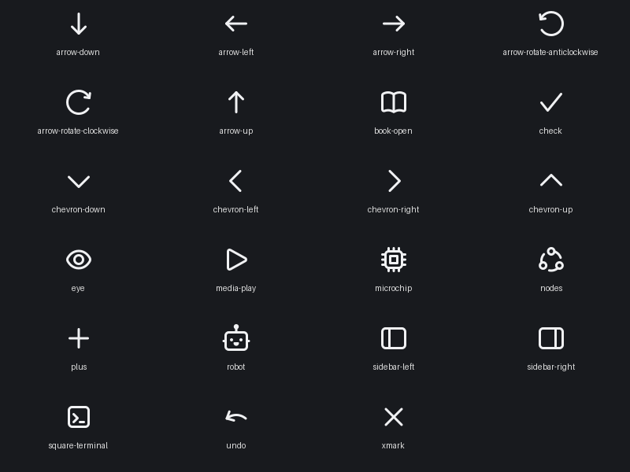

# Native backend and icon cleanup

The existing checkout was first committed on `dev` as `712e0ed5`.

## Repository and runtime

- Renamed `src-tauri/` to `backend/`, including Cargo paths, scripts, CI,
  documentation, and the consonance-ACE submodule configuration.
- Removed the Tauri framework dependency, UI-handle adapters, obsolete render
  and audio broadcasters, scanner for unmigrated Tauri commands, and generated mobile
  packaging icons. Desktop brand assets now live in `assets/app/`.
- Preserved every SQLite and Postgres migration byte-for-byte. Existing
  `com.luma.luma` data and cache locations remain unchanged.
- Replaced remaining Tauri task spawning with the owning host's Tokio runtime.
- Native desktop startup prepares Python in the background, resumes pending
  analysis after setup, and owns the Art-Net output loop. Harness startup
  excludes installation and physical-output side effects.
- Shared render sampling now handles identification and performance output,
  which previously depended on the unused Tauri event loop.
- Removed unused model helpers, audio beat-grid storage and its unused command
  argument, analysis-response metadata, renderer helpers, and speculative graph
  hit-test fields. Updated stale test fixtures for saved groups and frozen v2
  graph migration data.

## Icons

All 22 explicitly used native icon variants and the view-settings eye use
embedded Nucleo UI outline artwork: 23 SVG assets in total. The same assets are
installed in the desktop, component catalog, and pixel harness. Equivalent
stock component requests use the replacements too. Unused third-party component
assets remain available for the component library's own internals.

Keyboard legends retain their standard text symbols. Luma's mark and service
provider logos retain their brand artwork. Nucleo source labels and identifiers
are recorded in `gpui/crates/ui/assets/nucleo/README.md`.

## Verification and limits

Final backend unit suite: **941 passed, 12 ignored, 0 failed**. Native chrome
and graph harness selections: **10 passed**. Both workspace checks and Clippy
completed successfully; Clippy still reports existing nonfatal warnings.

The checks cover both Rust workspaces, Clippy, backend unit tests, the native
chrome and graph harness tests, migration byte equality, and a rendered Nucleo
contact sheet. New sampler tests cover identification expiry and manual output
without an editor scene.

Native pixel screenshots cannot run on this Linux host: the pinned GPUI
headless renderer is implemented only on macOS. The SVG contact sheet was
rendered and inspected; the actual macOS UI still needs a pixel pass.

Physical Art-Net devices and a cold Python installation were not exercised.
Native release packaging remains unconfigured. The Windows notification crate
`tauri-winrt-notification` remains transitively through `notify-rust`; it is not
the Tauri application framework.

An adjacent ownership issue remains: `get_patched_fixtures` updates the Art-Net
manager's patch as a side effect of a read. Explicit active-output venue
ownership would prevent another venue's inventory read from replacing that
patch. This cleanup preserves that existing behavior. Nonfatal Clippy warnings
elsewhere in the repository and the vendored GPUI snapshot also remain.

