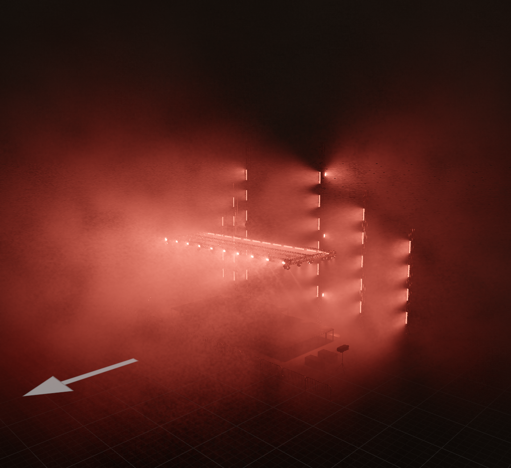

# Stage rendering quality and performance

Status: implementation direction, 2026-09-05. The user sets the target at Depence visual quality and Unreal-class realism while retaining high interactive performance. This is not a claim that the current renderer meets that target.

## Acceptance before algorithms

The user clarified that this pass should have minimal performance impact on the current non-Mac machine; a substantial Mac performance/approximation pass comes later. Hardware, output resolution, fixture count, and frame-rate target must be stated together for that pass. The available development GPU is an RTX 5090 running Vulkan; timings here cannot establish Apple Silicon performance. Treat 1080p, 60 Hz, and 512 moving fixtures as a provisional workload, not an agreed specification.

Review a complete venue with materials and geometry, not just cones against black. Pin camera, light output, exposure, medium density and source state. Explicitly enable surface lighting and fixture shadows: the historical React-compatible scene loader defaults surface lighting off. Preserve historical comparison fixtures, but do not use them to assess the native app's lighting quality.

The acceptance suite needs:

- A white room with a red surface: indirect red spill, occluded corners, no light through a separating wall.
- Black drapes, rough stage decks, metallic truss and reflective fixtures under the same lights.
- One calibrated fixture at several distances; matching surface illuminance and volumetric radiance.
- Hundreds of moving heads, dense overlapping beams, close cameras, beams aimed at the eye, and near-plane crossings.
- Blackout, strobes and fast RGB changes in motion. Reuse must not leave glowing history after a light turns off.
- Locked deterministic stills and a higher-sample reference render, plus live recordings of the same scene. A pleasing still does not prove correct motion or frame pacing.

Measure GPU stages separately, CPU submission, memory, and end-to-end presentation p50/p95/max. Report the light-index dispatch separately without adding it twice: it overlaps the scene span in the current renderer. Never describe correctness at 512 fixtures as a performance measurement. Existing profiler acceptance budgets are historical regression ceilings, not a 60 Hz specification.

## Current gaps verified in code

- The emitter-summed ambient fill has been removed after venue review: it lit surfaces even when beams hit nothing. There is currently no fixture-driven indirect lighting. Geometry-aware GI remains unimplemented.
- `luminaire.rs` uses relative per-kind lumen budgets and a shared beam gain. Fixture calibration is incomplete. Quoted zoom ranges are represented by a midpoint rather than live optics.
- `shadow.rs` has 16 resident 256-square fixture shadow maps. Other fixtures still light surfaces but do not cast fixture shadows. The profiler previously reported 120 shadowed fixtures by assumption; it must use actual residency.
- Haze uses per-pixel, per-candidate-light integration with analytic cone intersections and equiangular/uniform sampling. Preserve this useful estimator while reducing repeated work.
- Venue review demonstrated that preserving the old 3–18 m integration bounds preserved the visible cutoff. Bounds are now 24–60 m depending on concentration, with the same quartic support taper used for surface lights. This is still an approximation, not calibrated physical throw. It increases candidate coverage; the older unchanged-range performance results below do not describe this revision.
- The density field has two independent baked-texture lookups per sample and live time independent of playback. Source-to-sample extinction now supplements camera-path extinction. Its transport still uses a mean extinction and finite support taper; that is not yet a calibrated participating medium.

## Architecture to evaluate

1. **Shared physical lighting inputs.** Use one source spectrum/output, beam distribution, aperture/gobo, and live optics for surface shading, haze, shadows and indirect lighting. Calibrate against fixture photometry where available and clearly identify fallback estimates. Consistent scene units, exposure, color management and material reflectance come before cosmetic bloom.

2. **Geometry-aware indirect lighting.** Evaluate a world-space irradiance/radiance cache with visibility-aware probes and actual surface-hit lighting. Cache stable venue geometry, update changing direct illumination, and reuse a bounded amount of indirect work. The first milestone is one diffuse bounce with reflected material color and wall occlusion. Trace through a shared geometry representation; choose software traversal or hardware acceleration after platform capability and cost are verified. Do not assume that wgpu support or a powerful development GPU makes hardware tracing available on the target.

3. **Many-light visibility.** Keep all relevant fixtures eligible for surface illumination. Evaluate cached/variable-resolution shadowing and sampled visibility against a fully evaluated reference. Budget samples and updates, not arbitrary missing lights. Resampling or temporal reuse needs explicit strobe and blackout handling. A larger fixed shadow cap is not the design.

4. **Participating media.** Preserve sharp beam integration while amortizing low-frequency haze lighting in a spatial volume. Source-to-sample and sample-to-camera extinction must agree with surface composition. Fog should not emit arbitrary ambient light. World-space wisps and sparse density gaps should remain subtle under exposure. Separate numerical integration bounds from authored throw; any energy truncation needs a measured error bound.

5. **Temporal reconstruction.** Reproject with depth/geometry rejection and reactive handling of changing light output. Use retained information to lower sample cost without widening beam edges, smearing gobos, delaying shadows or extending strobes. Static captures remain deterministic.

6. **Materials and reflections.** Validate normals, linear material inputs and exposure. Diffuse GI and rough reflections may share cached lighting; sharper reflections need their own visibility/quality evaluation. A constant specular fill is not a reflection model.

Do not implement every subsystem simultaneously. First fix truthful measurement and reference scenes, then prove a geometry-aware diffuse-bounce slice against both an error reference and the agreed frame budget. The temporary ambient fill is already removed; do not restore it to hide the missing indirect transport. Profile dense/close-up cases before choosing the final volumetric and many-light algorithms.

## External calibration

Epic documents a 4 ms Lumen budget for the 60 fps console tier and 8 ms for the 30 fps tier at 1080p internal resolution, with temporal upsampling for higher output resolutions. Its surface lighting cache and radiance cache explicitly bound update work. These are examples of measured architecture budgets, not promises for this engine or hardware:
https://dev.epicgames.com/documentation/en-us/unreal-engine/lumen-performance-guide-for-unreal-engine

Syncronorm describes physically based light beams and PBR materials as part of Depence's lighting renderer. Use the rendered result as a quality reference without assuming its proprietary implementation:
https://www.syncronorm.com/products/depence2/visualization/lighting/page

## Earlier-pass measurements (superseded by the longer-range revision)

Release Vulkan on RTX 5090, 1920×1080 output, half-resolution haze, 8 samples, 120 warmup + 600 measured frames per run. Reference uses the previous committed haze/surface shaders and disables the temporary bounce estimate in an isolated copy. Current uses the two independent density samples, unchanged cull ranges and smooth polynomial tail. These are controlled renderer comparisons, not whole-app FPS. Shadows are the existing capped implementation, not a claim of accurate visibility for all lights.

| Case | Previous GPU p95 | Current GPU p95 |
|---|---:|---:|
| 512 overlapping lights | 8.67 ms | 8.10 ms |
| Close-up 128 lights | 5.67 ms | 4.72 ms |
| 120 lights, 2,057 opaque draws, 16 shadow maps (two runs) | 6.12–6.43 ms | 5.94–6.87 ms |

The dense case varies between runs; there is no consistent measured regression or established speedup there. No claim is made about other GPUs, actual venue datasets, or higher-resolution output. The extra third density lookup and the tripled light bounds were removed. Detailed measurements and artifact hashes are in `gpui/crates/render/goldens/render-refinement-perf-rtx5090.json`.

## Longer-range correction after venue review

The 3 m minimum integration radius was the source of the short wash blobs. The revised 24–60 m bounds preserve distant light and share the surface pass's quartic taper. Haze now attenuates along the source-to-sample path as well as the camera path. Neither this finite bound nor the relative source intensities constitute calibrated photometry.

With the live app suspended during both measurements, the original shader/reference at 8 m synthetic range measured 8.610 ms GPU p95; the revised transport at 24 m measured 9.386 ms (+9.0%). Same RTX 5090, Vulkan, 1080p, half-resolution haze, 8 samples, 512 overlapping lights, 120 warmup/600 measured frames. The longer-range run fails the existing mean-lights-per-tile ceiling (502.5 versus 360); GPU timing ceilings pass. Do not weaken that occupancy budget to hide the increased coverage. This synthetic comparison does not cover every new 60 m fixture bound or prove live-venue performance. Raw runs: `/tmp/luma-tail-baseline-512-isolated.json` and `/tmp/luma-tail-perf-512-isolated.json`.

Validation: 117 renderer unit tests and 7 transport integration tests pass. Deterministic image baselines updated for source extinction and taper changes; overlap energy, gobo attenuation, occlusion, invalid-input and temporal-history checks remain. The six-fixture reference was inspected at `/tmp/luma-tail-review/stage-review-1.370.png`. Actual venue visual acceptance and real indirect transport remain outstanding.

## Experimental shared geometry visibility

The native Renderer Lab now has **Experimental geometry shadows**, disabled by default. Launching the app with `LUMA_GEOMETRY_SHADOWS=1` initializes that toggle on; the user can turn it off in the Lab. Fixture shadows must also be enabled. This is a software visibility prototype, not MegaLights, hardware ray tracing, or GI.

`visibility.rs` builds a median-split, stackless triangle BVH over opaque stage geometry. It is retained across light/camera changes and rebuilt when stage mesh identities or transforms change. Fixture housings are excluded, matching the existing fixture shadow caster policy; transparent objects do not cast. The surface and haze shaders share the same buffer and ray/triangle traversal. Existing atlas residents keep their shadow maps; other lights query the BVH instead of being assumed unoccluded. Shadow mode changes invalidate temporal history.

The initial full-sample prototype cost 21.47 ms GPU p95 in a 20-frame dense-scene smoke run. The bounded version uses up to two MIS integration samples per fallback beam, with existing temporal reconstruction; map-backed beams retain their normal sampling. `LUMA_GEOMETRY_SHADOW_SAMPLES=8` selects an eight-sample comparison, capped by the scene's haze step count. Lower sampling introduces visibly more volume grain. Surface visibility remains evaluated for each contributing light; there is no stochastic light selection or surface denoiser yet. The next performance work must address that repeated visibility cost, not shorten the accepted beam reach.

Release RTX 5090 / Vulkan, 1080p, half-resolution haze, 120 lights, 2,057 opaque draws, 120 warmup and 600 measured frames, live app suspended:

| Mode | GPU total p95 | Surface pass p95 | Volume pass p95 |
|---|---:|---:|---:|
| Atlas only | 7.20 ms | 4.89 ms | 2.71 ms |
| Atlas + BVH, two fallback samples | 11.71 ms | 6.19 ms | 6.14 ms |

Pass percentiles are not additive. Raw results: `/tmp/luma-bvh-dense-off.json`, `/tmp/luma-bvh-dense-on.json`. This standard case uses synthetic 8 m bounds. A separate 24 m smoke run (20 measured frames) gave 12.39 ms GPU p95 but failed the existing occupancy ceiling: 111.6 mean lights/tile versus 100. It is not a full venue-performance claim. Raw: `/tmp/luma-bvh-dense-24m-smoke.json`.

The rendered regression puts 16 brighter lights facing away from the stage and a seventeenth aimed through a blocker. It verifies the seventeenth has no atlas slot, loses surface and haze energy with BVH enabled, and updates after moving the blocker. Existing deterministic transport baselines remain unchanged when the experiment is disabled. The 24-fixture visual comparison is at `/tmp/luma-visibility-on.png` and `/tmp/luma-visibility-review/visibility-review-1.370.png` (off). Neither image represents the user's actual venue.

Remaining: hardware/software traversal comparison, scalable sampling of lights, bounded shared volume lighting, geometry-aware indirect lighting, memory/build budgets for very large stage meshes, and strobe/blackout visual acceptance in the real venue. This prototype does not claim to meet the minimal-impact goal; it is switchable for evaluation.

## Gasworks harness rejection

The user reported about 5 FPS with the experiment enabled. The desktop app is now closed; renderer investigations use the offscreen harness. The live telemetry recorded a sampled 180.34 ms GPU frame (130.84 ms volume, 49.48 ms scene), 450 lit cones, and 389.9 mean lights/tile at 1146×1051. CPU submission was about 1.03 ms. This is a GPU visibility cost failure, not evidence of a CPU BVH rebuild bottleneck.

The read-only `render_venue` CLI can now export `--format catalogue`. It uses the same solved venue graph and fixture definitions as GPUI, with no session startup, migrations, or library writes. `profile-volumetrics --catalogue=PATH` loads that snapshot and renders a fixed full-output red rig with a fitted quarter-right camera. Live resolution settings are pinned to half-resolution haze, eight normal samples and two experimental fallback samples. This deliberately does not claim to replay the user's score or camera.

Gasworks Park contains 92 patched fixtures and 83 resolved stage pieces. Full output resolves to 470 cones and 215,059 opaque triangles. Release Vulkan / RTX 5090, 1146×1051, 30 warmup + 120 measured frames per mode:

| Mode | GPU total p95 |
|---|---:|
| Experiment off | 24.30 ms |
| Experiment on | 413.69 ms |
| Experiment on, surface lighting only | 127.09 ms |
| Experiment on, haze lighting only | 294.37 ms |

The full mode is 17.0× slower. Isolation controls retain geometry/depth and environment rendering; they disable fixture surface contribution or the haze pass respectively. Percentiles from separate runs are not additive. The generic 450-light dense scene measured 35.63→45.15 ms and the zoomed generic scene 19.88→23.42 ms, despite having 776,699 triangles: those synthetic shapes and light distributions did not predict Gasworks traversal cost. Their longer-range runs also exceeded existing occupancy budgets; those limits were not relaxed.

**Reject the current exhaustive software visibility approach for interactive use.** It still traces a separate world-triangle query for every contributing fallback light and integration sample. Sharing the acceleration structure alone does not bound that workload. Next experiments need bounded many-light visibility sampling/shared volumetric queries, a traversal strategy evaluated against this venue, and motion/blackout validation before any desktop relaunch. Lowering the fallback beam sample count alone did not meet the goal. GI remains unimplemented.

Reproduction (from the repository root; app remains closed):

```sh
cargo +1.97.1 run --manifest-path backend/Cargo.toml --bin render_venue -- --venue-id 346ce3ae-84e9-4c4f-916b-03bf4d115365 --output /tmp/gasworks.json --format catalogue --width 1146 --height 1051
LUMA_GEOMETRY_SHADOWS=0 cargo +1.97.1 run --release --manifest-path gpui/Cargo.toml -p luma-render --bin profile-volumetrics -- --catalogue=/tmp/gasworks.json --warmup-frames=30 --measured-frames=120
LUMA_GEOMETRY_SHADOWS=1 cargo +1.97.1 run --release --manifest-path gpui/Cargo.toml -p luma-render --bin profile-volumetrics -- --catalogue=/tmp/gasworks.json --warmup-frames=30 --measured-frames=120
```

Add `--surface-only` or `--haze-only` for isolation; `--image=/tmp/capture.png` captures the measured setup after the timing loop. Synthetic modes also accept `--cones=450`, so shadow workloads are no longer accidentally fixed at 120 emitters. Raw JSON, the saved catalogue, and inspected images are under `/tmp/luma-harness-visibility/`. Compact durable results: `gpui/crates/render/goldens/gasworks-visibility-perf-rtx5090.json`.


## Gasworks retained shadows and sampled fog (previous GPUI default)

The rejected per-sample software BVH is now a reference path, enabled only with
`LUMA_VISIBILITY_REFERENCE=1` and geometry shadows. GPUI defaults to **All fixture
shadows**. Production retains a 256-square depth map for every active emitter,
growing in powers of two to 512 layers across two 256-layer texture arrays.
Cache identity is projection plus opaque geometry; colour, intensity, blackout,
and light-list reordering do not redraw maps. A stage edit invalidates affected
cache identity. The complete 512-layer allocation costs 128 MiB; small rigs
allocate less. Surface lights continue evaluating all indexed contributors.

Caching alone left Gasworks around 28.8 ms GPU p95 with eight fog samples, or
19.5 ms after reducing broad washes to four samples. Neither met the requested
budget. The reduced integration budget was removed. Dense rigs now use weighted
reservoir selection in groups of eight broad, open-wash candidates. An analytic,
unshadowed equiangular estimate determines selection probability; the selected
light retains all eight integration samples and its own cached visibility. The
inverse probability preserves expected radiance before reconstruction. Narrow
beams and gobos remain exhaustively integrated. `LUMA_WIDE_LIGHT_GROUP=1` disables
selection for an exhaustive comparison; rigs with at most 128 emitters bypass it.

A separate fog render target carries sampled washes. A depth-guided 3×3 resolve
filters this target only, leaving narrow beams, gobos and ambient wisps outside
spatial reconstruction. This is a small amount of spatial smoothing, not exact
integration. It substantially reduces fresh-frame grain without relying on a
long history. Colour/dimmer cues and caster edits now reject stale history as
well as changes in optics and camera. Individual shadow maps retain their
existing resolution; this is not ray-traced GI, and GI is still unimplemented.

RTX 5090 / Vulkan, saved Gasworks Park, 470 emitters, 215,059 opaque triangles,
1146×1051, half-resolution fog, eight integration samples, 60 warmup + 600
measured frames, app closed:

| Workload | GPU total p95 | CPU encode/submit p95 | Maximum maps redrawn |
|---|---:|---:|---:|
| Fixed rig | 12.47 ms | 0.98 ms | 0 |
| 32 directions moving | 12.84 ms | 1.89 ms | 32 |
| All 470 directions moving (stress) | 15.91 ms | 13.07 ms | 470 |
| Alternating blackout | 12.49 ms | see JSON | 0 |

These are renderer timings, not application FPS. The fixed and 32-moving runs
leave about 4 ms of the 16.67 ms / 60 FPS budget for other GPU work. The forced
all-moving case does not have that headroom and still has a substantial CPU
shadow-submission cost. Initial allocation/preparation of all 470 maps costs
about 242 ms CPU: steady-state numbers do not describe venue-load latency.

At time zero, a 16-subframe capture differs from exhaustive cached lighting by
mean absolute RGB [0.372, 0.184, 0.161] / 255, and from the eight-sample triangle
visibility reference by [0.492, 0.208, 0.178] / 255. These global means cannot
certify individual shadow edges or animation. Fresh one-subframe moving-light
images were inspected too; some grain remains. Surface shadow resolution and
spatial reconstruction remain approximations. No claim of Depence/Unreal parity.

Reproduce after exporting the same read-only catalogue described above:

```sh
cargo +1.97.1 build --manifest-path gpui/Cargo.toml -p luma-render --release --bin profile-volumetrics
cd gpui
LUMA_GEOMETRY_SHADOWS=1 ./target/release/profile-volumetrics --catalogue=/tmp/luma-harness-visibility/gasworks.json --warmup-frames=60 --measured-frames=600
```

Add `--moving-cones=32`, `--moving-cones=470`, or `--blackout` for the stress cases.
`--image=PATH` writes a standalone 16-subframe image after timing;
`--image-subframes=1` checks fresh-frame quality instead of hiding it behind
accumulation. These cases rotate cone directions only, not fixture housing,
and do not replay a score. Durable measured results and provenance are in
`gpui/crates/render/goldens/gasworks-sampled-perf-rtx5090.json`.

Validation: 121 renderer unit tests and seven volumetric transport tests pass,
including reservoir colour/energy, partial groups, cue history reset, cache
blackout/reordering, and visibility beyond layer 256. Workspace all-targets
check and native app build pass; the app was not launched. Broader checks retain
two environment hash failures documented on 2026-08-31, a textured-PBR capture
mismatch, and a venue portal-builder refusal. Those expected images and the
unrelated builder were not changed to make the suite green.


## Shared broad-wash grid (current GPUI live default)

Dense shadowed live rigs now share distant broad-wash lighting in a camera-relative
radial grid. Gasworks uses 72×66×128 cells: 16 full-resolution pixels across each
column, quadratic distance slices, and independently jittered lighting samples.
Each 64-lane workgroup evaluates lights with adjacent lanes reading adjacent
records. Four disjoint weighted reservoirs select visibility queries; inverse
selection probability preserves expected incident radiance at the sampled point.
A parallel prefix scan integrates advected density and camera extinction along
each column. A haze pixel then reads its integrated lighting at scene depth.

The source region remains analytic: full contribution inside two metres, smoothly
handing off to the grid between two and four metres. These weights sum to one;
this is not a shorter beam range. Narrow beams and gobos keep their full per-ray,
eight-sample integration. The unified light index now has a second mask plane
for analytic source regions, using the same tiles and sorted ids. Rejecting these
candidates once per tile removed a large amount of repeated per-pixel work.

The two grid textures cost about 9.32 MiB at 1146×1051; the additional mask plane
costs 1.16 MiB. Grid textures are allocated only when first used and retained
across blackouts. Small rigs, haze-off frames, and frames without all-fixture
shadows bypass grid computation. `LUMA_GRID_FOG=0` selects the previous per-ray
live method for A/B measurements. Standalone captures accumulating multiple
subframes retain that method for converged spatial detail. `LUMA_WIDE_LIGHT_GROUP=1`
remains the exhaustive per-ray reference and disables the grid too.

This is a live quality/performance tradeoff, not exact transport: fresh frames
have less grain, but settled distant fog can be slightly softer than the per-ray
reference. Grid interpolation, finite depth quadrature, and shadow reservoirs
remain approximations. Near-source detail, gobo transport, surface lights and
shadow-map resolution are preserved. **GI is still unimplemented.** Camera and
moving-light history currently reset wholesale; motion-aware reprojection and
CPU submission for hundreds of moving shadow maps remain separate bottlenecks.

Validation adds a conservative near-mask comparison, shared-volume caster-motion
coverage, and colour/blackout/restore history checks. All 122 renderer unit tests
and eight transport tests pass; the existing transport goldens remain unchanged.
Workspace all-targets checking passes. Broader unrelated failures listed in the
previous section were not addressed by this change.

The harness now accepts `--image-live --image-subframes=1` to save a frame with
live history retained; `--image-subframes=1` alone still captures a fresh frame.
Performance figures below use sequential release runs with the app and game
closed, 60 warmup + 600 measured frames, the same exported Gasworks catalogue,
1146×1051, half-resolution haze, and eight analytic integration samples. Moving
cases rotate emitter directions, not fixture housings, and are not score replays.
GPU timings are renderer timings, not application FPS.


Quality checks use a fresh time-zero frame and the same 16-subframe exhaustive
cached-shadow reference. Mean absolute display RGB error (averaged across RGB,
in 8-bit values) is 0.886→0.758 for the fixed rig and 0.884→0.755 with 32 directions
moving, about 15% lower. These global metrics do not certify local shadow edges.
With live history settled at 149/60 seconds, the mean is 0.323→0.468: the grid is
not an improvement in converged accuracy. The default 16-subframe standalone
capture remains byte-identical to the previous accepted capture (RGBA SHA-256
`de0bebe56604ac668eb44ffabf305b19899a62d1325cbaf810ee9e0ef11ccf98`).

The checked-in review images are fresh frames from the full-red harness cue,
not a score replay or automatic hash goldens:

| Previous per-ray live fog | Shared-grid live fog |
|---|---|
|  |  |


Final rebuilt-binary comparison (RTX 5090 / Vulkan, driver 595.84):

| Workload | Previous GPU p95 | Shared-grid GPU p95 | Shared-grid CPU p95 |
|---|---:|---:|---:|
| Fixed rig | 12.50 ms | 8.60 ms | 0.98 ms |
| 32 directions moving | 12.86 ms | 9.04 ms | 2.06 ms |
| All 470 directions moving | 15.76 ms | 11.91 ms | 12.22 ms |
| Alternating blackout | 12.40 ms | 8.59 ms | 0.92 ms |

Fixed-rig GPU time fell 31.2%, with the volumetric span falling 45.3%
(8.56→4.68 ms). All fixture shadow maps remain resident; static and blackout
runs redrew zero maps, moving cases redrew at most 32/470. The all-moving case
still spends 12.22 ms CPU p95 submitting shadows, which limits application
headroom independently of the faster GPU work.

Both native debug and release apps were rebuilt on `agent-code-execution-linux`;
neither was launched. The release harness executable, code provenance, raw
summaries, quality measurements, and limitations are recorded in
[`gasworks-grid-perf-rtx5090.json`](../../gpui/crates/render/goldens/gasworks-grid-perf-rtx5090.json).
