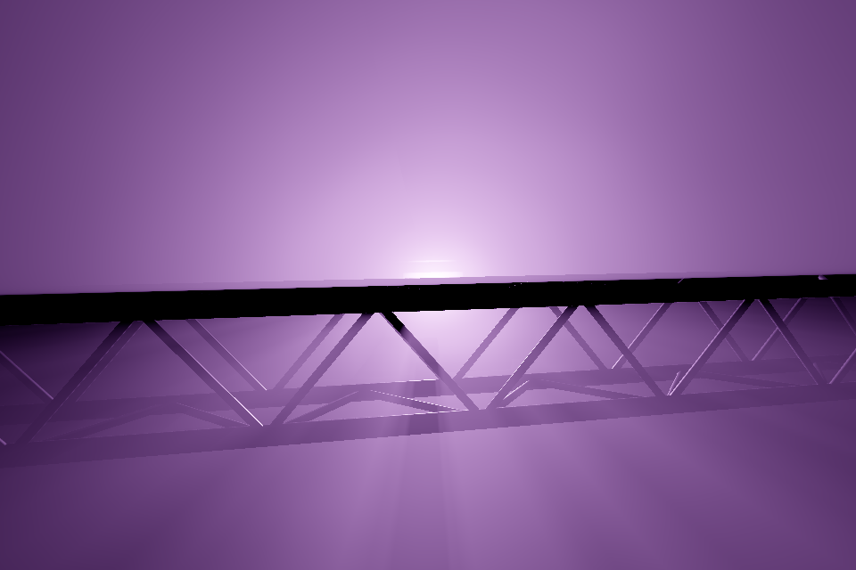
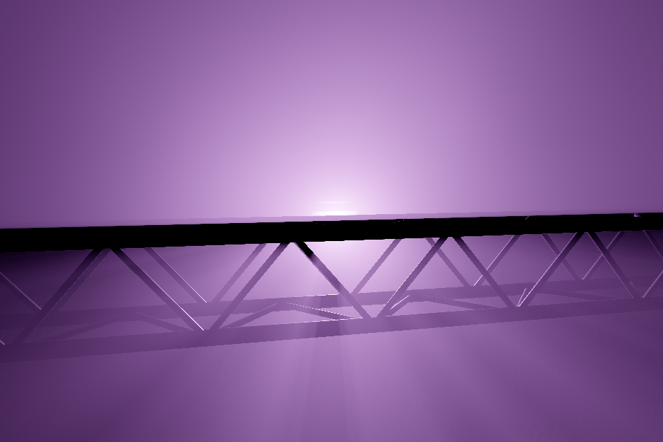
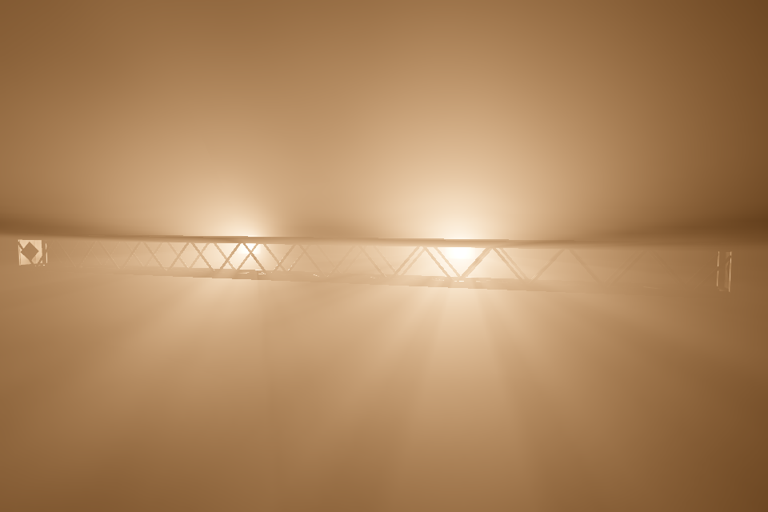
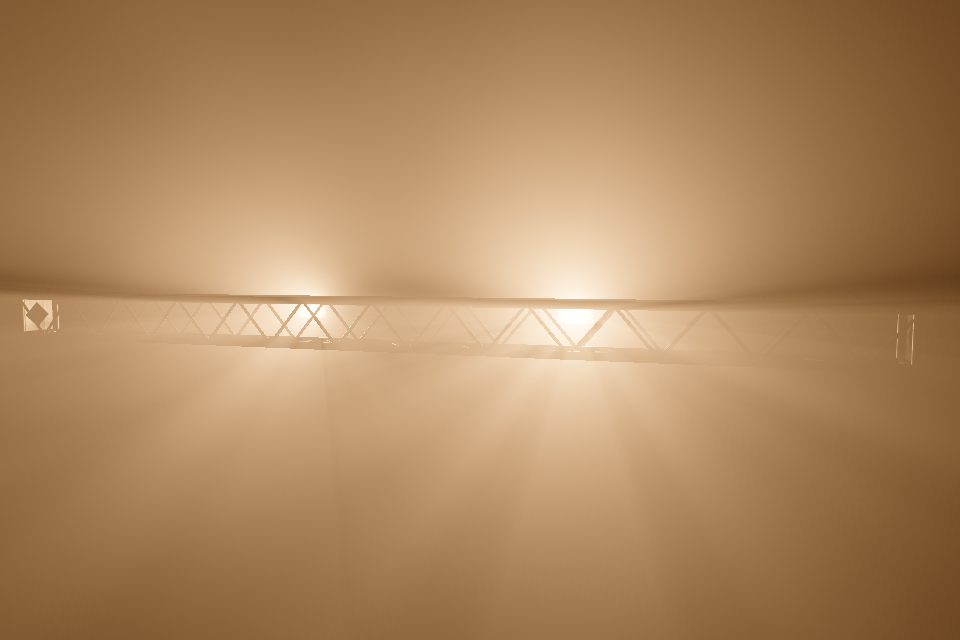

# Native volumetric shadow precision — 2026-09-09

The live renderer now preserves fine shadow intervals at native pixel resolution. It removes stochastic grain from ordinary ungoboed beams and broad washes, while sharing the expensive far-field lighting. The production Get Lucky/Gasworks replay at 1634×750 measured **3.95–4.14 ms median GPU time, 5.39–5.60 ms p95**, across two 1,152-frame runs. Both runs stayed below 6.16 ms. These are GPU timings, excluding GPUI, picking, presentation, and readback waits; they do not establish live presented FPS.

[Measurements](haze-results-rtx5090.json) · [Reproduction](haze-lab.md) · [Full local comparison](/tmp/luma-haze-v2/comparison.html)

## Image evidence

Live and exhaustive 64×32 reference, identical camera and physical settings:

| Live | Reference |
| --- | --- |
|  |  |
|  |  |
|  |  |

The 26 pinned views cover six Gasworks cameras at 1, 3, and 7 seconds, four controlled truss-shadow angles, a warm close-up, and the actual replay camera at all three times. Display-space RMSE against the reference is 0.17–1.06 on a 0–255 scale; after a 20 cm camera translation it is at most 1.08. Eight repeated frozen frames have zero temporal variance. The three full-size replay views are within 0.24–0.26 RMSE.

Disabling both conservative visibility optimizations produces the same image apart from isolated one-code-level rounding differences (at most 53 pixels in any capture, RGBA RMSE ≤0.0051). No noise or shadow quality was traded for those savings.

## What changed

- Native per-pixel integration traverses cached min/max shadow maps to find actual visible intervals. Four-point Gaussian quadrature integrates only those lit spans in equiangular coordinates. Near broad sources and ordinary spots retain thin shadow shafts without random ray samples.
- A 128-slice grid shares broad far-field lighting. Every contributing light is evaluated, with one GPU lane per volume cell. Four shadow samples remain at unresolved boundaries.
- Conservative 4×4×4 block bounds prove groups of cells wholly lit or dark. Proofs come from the existing depth maps; unresolved blocks retain the per-cell checks. The same procedure runs at every light count.
- Camera depth bounds omit only prefixes that no visible pixel can request, including bilinear support around thin geometry. Density and camera transmittance are integrated once and shared across lights.
- Fixed fixture shadows and their min/max mipmaps survive color/dimmer changes and blackouts. Moving fixtures or casters invalidate the appropriate geometry data. Final colored radiance is never cached across cues or medium changes.
- The source optical-depth cache uses hardware-filtered texture sampling. Aperture basis normalization is precomputed per light, with no increase to the 64-byte light record.
- Deterministic lighting runs once, independently of the stochastic subframe budget. It also bypasses historical blending, so moving haze follows the current scene time. Gobos retain their stochastic sample budget.
- Reference captures now explicitly disable light selection, shared-grid interpolation, and spatial denoising. This avoids mistakenly comparing against a blurred reference.

The interval approach was informed by [Chen et al., Real-Time Volumetric Shadows using 1D Min-Max Mipmaps](https://groups.csail.mit.edu/graphics/mmvs/). This implementation uses a camera-independent 2D shadow hierarchy, rather than their rectified epipolar structure.

## Experiments and performance

Blindly increasing ray samples or refining every cell was rejected. The native precision prototype initially cost 11.6 ms median / 15.1 ms p95 in the same replay. Sharing camera attenuation, eliminating duplicate deterministic subframes, conservative shadow proofs, and coherent block culling reduced it to the figures above. The final target remains native resolution with an 8-pixel, 128-slice far-field grid.

For context, the old half-resolution production renderer measured about 4.0 ms median / 4.7 ms p95. The new renderer has much higher spatial precision at a similar median cost, with a somewhat higher p95. The performance claim is not a threefold improvement over the old lower-quality production default.

Early frozen harness timings used one subframe accidentally; production uses two. The harness has been corrected, and all saved-score replays used two throughout. Frozen quality captures were allowed to coexist with other GPU work, so their timings are excluded from the final performance evidence. The actual replay runs briefly suspended the background app, then resumed it automatically.

## Validation and limits

143 targeted tests pass: 126 renderer library, six procedural-haze, and eleven transport tests. The optional GPU benchmark is separate. Workspace all-targets checking passes. New tests cover native shadow agreement with an exhaustive reference, energy independence from live subframe count (including a mixed stochastic pass), and density updates without temporal lag. Existing tests cover moving casters, shadow-cache reuse, cue changes, blackout, camera/resize resets, and 32/128/512-light transport.

The eight affected capture goldens were inspected before updating: their largest RGB difference is one code level, and their largest RMSE is 0.045. Those changes come from the filtered optical cache and arithmetic rounding.

The reference still shares the single-scattering model, finite source-extinction cache, and fixture shadow maps. Agreement with it is not independent proof of photographic realism. Far-field lighting retains finite grid precision, and gobos remain stochastic.

An adjacent limitation remains: fixture shadow cameras cap their field of view at 170°. Extremely wide wash profiles retain the existing unshadowed behavior outside that projection. Fixing that coverage requires a wider shadow representation, not extra haze samples; it was not changed here.
